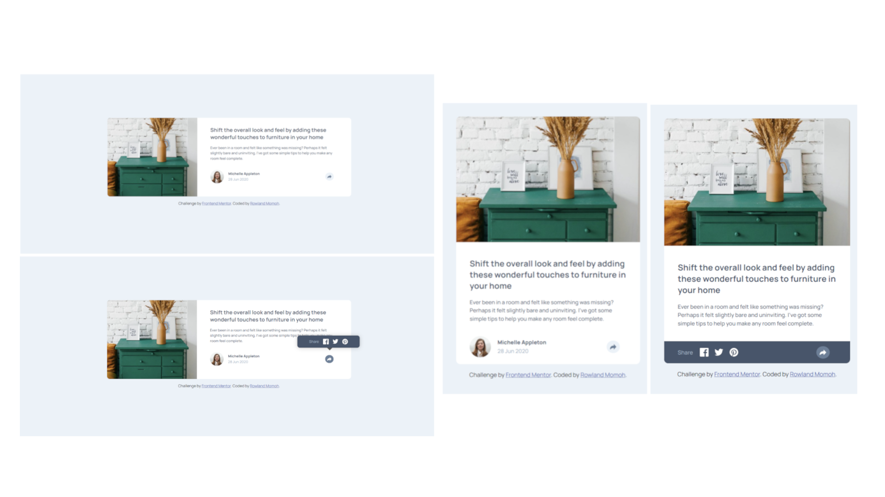

# Frontend Mentor - Article preview component solution

This is a solution to the [Article preview component challenge on Frontend Mentor](https://www.frontendmentor.io/challenges/article-preview-component-dYBN_pYFT). Frontend Mentor challenges help you improve your coding skills by building realistic projects. 

## Table of contents

- [Overview](#overview)
  - [The challenge](#the-challenge)
  - [Screenshot](#screenshot)
  - [Links](#links)
- [My process](#my-process)
  - [Built with](#built-with)
  - [What I learned](#what-i-learned)
  - [Continued development](#continued-development)
  - [Useful resources](#useful-resources)
- [Author](#author)
- [Acknowledgments](#acknowledgments)

## Overview

### The challenge

Users should be able to:

- View the optimal layout for the component depending on their device's screen size
- See the social media share links when they click the share icon

### Screenshot



### Links

- Solution URL: [Click here](https://your-solution-url.com)
- Live Site URL: [Click here](https://fe-article-component.netlify.app/)

## My process

### Built with

- Semantic HTML5 markup
- CSS custom properties
- Flexbox
- CSS Grid
- Mobile-first workflow
- Vanilla JavaScript


### What I learned

I learnt more about Mobile first approach to responsive design, CSS positioning, CSS clip-path property, JavaScript DOM and more.

I understood how to dynamically alter the footer with the js function below:

```
function toggleFooter() {
    footer.classList.toggle('active')
    userInfo.classList.toggle('hide')
    shareBar.classList.toggle('hide')

    if (footer.classList.contains('active'))
    {
        shareArrow.classList.toggle('white')
        arrow.classList.toggle('d-bg')
    }
    else 
    {
        shareArrow.classList.remove('white')
        arrow.classList.remove('d-bg')
    }
}
```

### Continued development

I need to learn more about JS DOM and other CSS properties to build projects more efficiently.


### Useful resources

- [w3schools/howto](https://www.w3schools.com/howto/tryit.asp?filename=tryhow_js_popup) - This helped me understand how to create popups using css. I really liked this pattern and will use it going forward.


## Author

- Website - [Rowland Momoh](https://rowland-momoh.netlify.app/://www.your-site.com)
- Frontend Mentor - [@rowleks](https://www.frontendmentor.io/profile/rowleks)
- Twitter - [@Rolexks](https://x.com/Rolexks)


## Acknowledgments

I'm grateful to frontend mentor for this challenge as it helps build my web development skills further. I also thank google, w3school, dev.to and other similar sites for their amazing and helpful resources.
